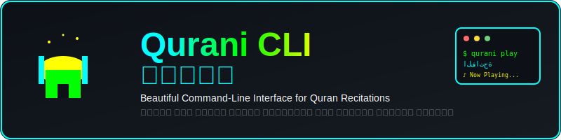

# 🕌 Qurani CLI - قرآني

<div align="center">



[](https://github.com/MahdiDbh/Quran_cli/releases)
[](LICENSE)
[](https://github.com/MahdiDbh/Quran_cli/stargazers)

**🎵 A beautiful command-line interface to listen to Quran recitations**  
*أداة سطر أوامر جميلة للاستماع إلى تلاوات القرآن الكريم*

[English](#english) | [العربية](#arabic)

</div>

---

## 🌟 Features | المميزات

<table>
<tr>
<td width="50%">

### 🎯 **English Features**
- 🕌 **Beautiful CLI interface** with colors and emojis
- 📖 **114 Surahs** with Arabic & English names
- 🎙️ **Multiple renowned reciters** available
- ⚡ **Fast and lightweight** - pure shell script
- 🌐 **Bilingual support** - Arabic & English
- 📱 **Easy installation** with one command
- 🔄 **Auto-update** functionality
- 🎵 **High-quality audio** streaming

</td>
<td width="50%">

### 🎯 **المميزات العربية**
- 🕌 **واجهة سطر أوامر جميلة** بالألوان والرموز
- 📖 **114 سورة** بالأسماء العربية والإنجليزية  
- 🎙️ **قراء متعددون مشهورون** متاحون
- ⚡ **سريع وخفيف** - سكريپت shell خالص
- 🌐 **دعم ثنائي اللغة** - عربي وإنجليزي
- 📱 **تثبيت سهل** بأمر واحد
- 🔄 **تحديث تلقائي**
- 🎵 **صوت عالي الجودة**

</td>
</tr>
</table>


---

## 🚀 Quick Start | البدء السريع

<div id="english">

### 📦 Installation Methods

#### ⚡ Method 1: One-Line Install (Recommended)

```bash
curl -sSL https://raw.githubusercontent.com/MahdiDbh/Quran_cli/main/qurani.sh -o ~/.local/bin/qurani && chmod +x ~/.local/bin/qurani
```

> **Note:** Make sure `~/.local/bin` is in your PATH:
> ```bash
> echo 'export PATH="$HOME/.local/bin:$PATH"' >> ~/.bashrc && source ~/.bashrc
> ```

#### 🌍 Method 2: System-wide Install

```bash
sudo curl -sSL https://raw.githubusercontent.com/MahdiDbh/Quran_cli/main/qurani.sh -o /usr/local/bin/qurani
sudo chmod +x /usr/local/bin/qurani
```

#### � Method 3: Manual Download

1. **Clone the repository:**
   ```bash
   git clone https://github.com/MahdiDbh/Quran_cli.git
   cd Quran_cli
   ```

2. **Make executable and move to PATH:**
   ```bash
   chmod +x qurani.sh
   cp qurani.sh ~/.local/bin/qurani
   ```

</div>

<div id="arabic">

### 📦 طرق التثبيت

#### ⚡ الطريقة الأولى: تثبيت بأمر واحد (موصى به)

```bash
curl -sSL https://raw.githubusercontent.com/MahdiDbh/Quran_cli/main/qurani.sh -o ~/.local/bin/qurani && chmod +x ~/.local/bin/qurani
```

> **ملاحظة:** تأكد أن `~/.local/bin` في PATH:
> ```bash
> echo 'export PATH="$HOME/.local/bin:$PATH"' >> ~/.bashrc && source ~/.bashrc
> ```

#### 🌍 الطريقة الثانية: تثبيت على مستوى النظام

```bash
sudo curl -sSL https://raw.githubusercontent.com/MahdiDbh/Quran_cli/main/qurani.sh -o /usr/local/bin/qurani
sudo chmod +x /usr/local/bin/qurani
```

#### 📥 الطريقة الثالثة: تحميل يدوي

1. **استنساخ المستودع:**
   ```bash
   git clone https://github.com/MahdiDbh/Quran_cli.git
   cd Quran_cli
   ```

2. **جعل الملف قابل للتنفيذ ونقله:**
   ```bash
   chmod +x qurani.sh
   cp qurani.sh ~/.local/bin/qurani
   ```

</div>

---

## 🛠 Usage Guide | دليل الاستخدام

### 🎵 Basic Commands | الأوامر الأساسية

<table>
<tr>
<th width="50%">🇺🇸 English Commands</th>
<th width="50%">🇸🇦 الأوامر العربية</th>
</tr>
<tr>
<td>

```bash
# Show help and all commands
qurani

# List all 114 surahs
qurani list-surahs

# List available reciters  
qurani list-reciters

# Play surah by English name
qurani play Al-Fatiha

# Play surah by number with specific reciter
qurani play 2 hus

# Play with different reciter
qurani play Al-Baqara abd

# Show version
qurani --version
```

</td>
<td>

```bash
# عرض المساعدة وجميع الأوامر
qurani

# عرض جميع الـ 114 سورة
qurani list-surahs

# عرض القراء المتاحين
qurani list-reciters

# تشغيل سورة بالاسم العربي
qurani play الفاتحة

# تشغيل سورة بالرقم مع قارئ محدد
qurani play 2 hus

# تشغيل مع قارئ مختلف
qurani play البقرة abd

# عرض الإصدار
qurani --version
```

</td>
</tr>
</table>

### 🎙️ Available Reciters | القراء المتاحون

| ID | Arabic Name | English Name |
|:--:|:------------|:-------------|
| `afs` | مشاري العفاسي | Mishary Alafasy |
| `hus` | ماهر المعيقلي | Maher Al Muaiqly |
| `abd` | عبد الباسط | Abdulbasit Abdussamad |

> **Default:** If no reciter is specified, Mishary Alafasy (`afs`) will be used.  
> **افتراضي:** إذا لم يتم تحديد قارئ، سيتم استخدام مشاري العفاسي (`afs`).

---

## 🔄 Update | التحديث

### Quick Update | تحديث سريع

```bash
# For user installation
curl -sSL https://raw.githubusercontent.com/MahdiDbh/Quran_cli/main/qurani.sh -o ~/.local/bin/qurani

# For system-wide installation  
sudo curl -sSL https://raw.githubusercontent.com/MahdiDbh/Quran_cli/main/qurani.sh -o /usr/local/bin/qurani
```

---

## 💻 Requirements | المتطلبات

<div align="center">

### 🎵 Audio Player | مشغل الصوت

You need **one** of these audio players installed:  
*تحتاج إلى **واحد** من مشغلات الصوت هذه:*

</div>

<table>
<tr>
<th width="50%">🎶 MPV (Recommended)</th>
<th width="50%">🎵 VLC Media Player</th>
</tr>
<tr>
<td>

**Ubuntu/Debian:**
```bash
sudo apt install mpv
```

**Fedora/RHEL:**
```bash
sudo dnf install mpv
```

**Arch Linux:**
```bash
sudo pacman -S mpv
```

**macOS:**
```bash
brew install mpv
```

</td>
<td>

**Ubuntu/Debian:**
```bash
sudo apt install vlc
```

**Fedora/RHEL:**
```bash
sudo dnf install vlc
```

**Arch Linux:**
```bash
sudo pacman -S vlc
```

**macOS:**
```bash
brew install vlc
```

</td>
</tr>
</table>

### 🌐 Network Requirements | متطلبات الشبكة

- **Internet connection** for streaming audio  
- **اتصال إنترنت** لتشغيل الصوت المباشر

---

## 🤝 Contributing | المساهمة

We welcome contributions! Here's how you can help:  
*نرحب بالمساهمات! إليك كيف يمكنك المساعدة:*

### 🛠 Development | التطوير

1. **Fork the repository**
2. **Create a feature branch:**
   ```bash
   git checkout -b feature/amazing-feature
   ```
3. **Make your changes**
4. **Test thoroughly**
5. **Commit your changes:**
   ```bash
   git commit -m "Add amazing feature"
   ```
6. **Push to the branch:**
   ```bash
   git push origin feature/amazing-feature
   ```
7. **Open a Pull Request**

### � Bug Reports | تقارير الأخطاء

Found a bug? Please open an issue with:
- **Operating System**
- **Shell version** (`bash --version`)
- **Audio player** (mpv/vlc version)
- **Steps to reproduce**
- **Expected vs actual behavior**

### 💡 Feature Requests | طلبات الميزات

Have an idea? Open an issue and describe:
- **What you want**
- **Why it would be useful**  
- **How it should work**

---

## 📄 License | الرخصة

This project is licensed under the **MIT License** - see the [LICENSE](LICENSE) file for details.

**MIT License** allows you to:
- ✅ Use commercially
- ✅ Modify  
- ✅ Distribute
- ✅ Private use

---

## 🙏 Acknowledgments | شكر وتقدير

- **القراء الكرام** for their beautiful recitations
- **mp3quran.net** for providing the audio files
- **Open source community** for inspiration and tools
- **Contributors** who help improve this project

---

## 👨‍� Author | المطور

<div align="center">

**Mahdi Debbah** | **مهدي دبّاح**

[](https://github.com/MahdiDbh)
[](mailto:your-email@example.com)

*Made with ❤️ for the Muslim community*  
*صُنع بـ ❤️ للمجتمع المسلم*

</div>

---

<div align="center">

### ⭐ Star this project if you find it useful! | ⭐ ضع نجمة للمشروع إذا وجدته مفيداً

[](https://github.com/MahdiDbh/Quran_cli/stargazers)

**بارك الله فيكم | May Allah bless you all**

</div>